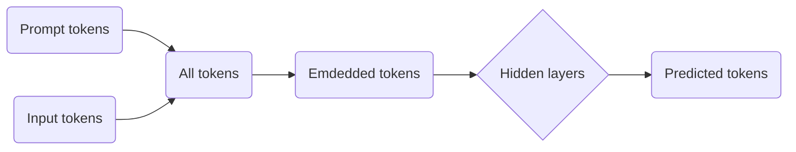
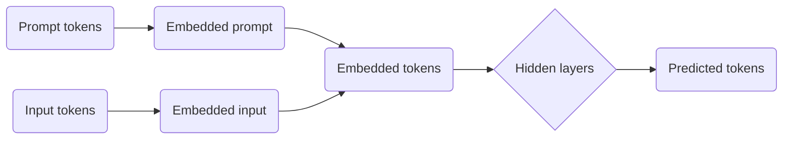

# Prompt Tuning
> Данный материал является обзором на технологию Prompt Tuning, основные материалы взяты из статьи [[1]](##Список-источников).
## Введение
Основанный на глубоком обучении подход для решения задач анализа текста стал активно набирать обороты, когда в 2017 году была опубликована статья Attention Is All You Need [[2]](##Список-источников), представившая миру механизм внимания, хорошо подходящий для работы с текстом, позволяющий прослеживать сложные связи между словами.

Рис. 1. Задачи NLP

Размер нейронных сетей с архитектурой `Transformer` значительно превышает размер своих предшественников - рекуррентных сетей.  Даже небольшие BERT (Bidirectional Encoder Representations from Transformers) [[3]](##Список-источников), модели могут содержать **десятки миллионов параметров**, из-за чего их обучение "с нуля" может занять значительное количество времени и потребовать большого количества экземпляров для обучения.

### Fine Tuning
В связи с этим, широкое распространение получила техника **Fine Tuning**, основанная на том, что вначале создается экземпляр базовой модели, **предобученной на стандартной задаче** для работы с текстом, такой как маскирование, c использованием больших корпусов текста, а затем уже этот базовый экземпляр **дообучается** на решении самых разных частных задач. Эта техника требует меньшего времени обучения, однако не решает проблему.

Особенно остро она проявляется для генеративных моделей, содержащих миллиарды параметров, так называемых LLM или GPT. Их качественное обучение задействует значительные вычислительные ресурсы, что может стоить достаточно дорого. 

### Prompt Engineering
Чтобы избежать высоких затрат на обучение, часто используют более простой подход под названием **Prompt Engineering** [[4]](##Список-источников), когда модели передается инструкция, написанная человеком, в которой описывается задача, которую предстоит решать. Так, например, в ней можно дать указания на перевод текста с одного языка на другой.

Преимуществом данной техники является полное отсутствие необходимости в обучении модели, ее веса **замораживаются**. При каждом запуске ей передается подготовленная инструкция с аргументами, по которым нужно сделать предсказание. Существенным недостатком является **сложность в подборе оптимальной инструкции**, поскольку эта задача ложится целиком на человека. Чем больше промпт, тем сложнее модели работать со всем контекстом, что влечет к более низким результатам.

Например, GPT-3 175B с Few-Shot Prompting показал на 17.5 очков меньше, чем T5-XXL (71.8 vs. 89.3), к которому был применен Fine Tuning, несмотря на то что первая модель в 16 раз больше второй [[6]](##Список-источников).

В связи с этим, в 2021 году была разработана новая техника под названием **Prompt Tuning**, речь о которой и пойдет далее.

## 1. Описание Prompt Tuning
Данная техника во многом похожа на Prompt Engineering. Существенным отличием является то, что промпт в этом случае будет формироваться не человеком (**hard-prompt**), а искусственным интеллектом (**soft-prompt**).

Рис. 2. Сравнение техник по SuperGLUE Score [[5]](##Список-источников)

Рассмотрим применение данной техники на примере задачи классификации с использованием Text-To-Text генерации [[6]](##Список-источников).

Вместо классической постановки задачи, $Pr(y|X),$ где $X$ является последовательностью токенов, а $y$ - меткой одного из классов, мы представим это в виде $Pr_\theta(Y|X)$, где $Y$ - последовательность токенов, отражающих метку класса, $\theta$ - фиксированная совокупность параметров предобученного трансформера. Таким образом, мы оставим веса модели замороженными,  что является существенным различием с **Fine Tuning**. Также обозначим токены промпта за $P$.

Важно отметить, что в случае с **Prompt Engineering**, выражение примет вид $Pr_\theta(Y|[P;X])$, то есть произойдет конкатенация последовательностей токенов $P$ и $X$, после чего полная последовательность перейдет на вход модели, а именно на `Embedding` слой, параметризованный $\theta$. Данный слой инициализирует каждый токен `embedding`'ом (вектором) длины $e$.

Рис. 3. Схема работы с моделью при использовании Prompt Engineering.

Токены промпта $\{p_1, p_2, ..., p_n\}$ будут **векторизованы замороженными параметрами** модели $\theta$. При этом, сам промпт эмпирически составлен человеком, а значит с большой вероятностью данное векторное представление инструкции будет неоптимальным.

 Использование **Prompt Tuning** подразумевает задействовать формулу $Pr_\theta;_{\theta_P}(Y|[P;X])$, то есть векторизация промпта будет происходить за счет **отдельного набора параметров** $\theta_P$, которые будут оптимизироваться градиентным спуском в рамках обучения. Иными словами, **обучаться будет не модель, а промпт**.  Стоит отметить, что обратное распространение все равно должно пройти все слои модели, чтобы донести необходимые дельты для параметров промпта.

Итак, по набору входных токенов $\{x_1, x_2, ..., x_n\}$, с использованием фиксированных параметров модели $\theta$ будет сформирована матрица векторизованных токенов $X_e\in\R^{n×e}$. Затем, soft prompt $P$ будет векторизован весами $\theta_P$, получим $P_e\in\R^{p×e}$. Далее, получаем конкатенацию вышеуказанных матриц $[P_e;X_e]\in\R^{(p+n)×e}$, которая пойдет на следующий после `Embedding` слой LLM.

Рис. 4. Схема работы с моделью при использовании Prompt Tuning.

## 2. Prompt Ensembling
При использовании данной техники одну и ту же модель можно параллельно обучать различным задачам, передавая различные промпты. Аналогично можно поступать и в `inference` режиме. Это очень важное преимущество для систем, решающих сразу несколько задач, поскольку в оперативную память необходимо поместить всего одну модель, в которую будет передаваться промпт, связанный с конкретной задачей, который может быть легко заменен на промпт для другой задачи.

Рис. 5. Отличие Fine Tuning от Prompt Tuning

## 3. Гиперпараметры промпта
Стоит отметить, что человек не принимает участие в инициализации soft промпта, его длина и начальные значения являются гиперпараметрами. Было проведено множество измерений применения данной техники на серии моделей T5 с различными длинами промпта, начальными значениями, методами предобучения, количеству шагов LM адаптации. Результаты представлены ниже: 

Рис. 6. Сравнение гиперпараметров

## Заключение
Техника Prompt Tuning показывает действительно многообещающие результаты для моделей значительного размера.
Используя данный подход, можно провести значительно более быстрое обучение в сравнении со стандартным Fine Tuning и получить более качественные результаты в сравнении с Prompt Engineering. Более того, для отдельных задач результаты Prompt Tuning даже превосходят результаты Fine Tuning. 

## Список источников
1. Brian Lester, Rami Al-Rfou, and Noah Constant. 2021. [The Power of Scale for Parameter-Efficient Prompt Tuning](https://aclanthology.org/2021.emnlp-main.243). In _Proceedings of the 2021 Conference on Empirical Methods in Natural Language Processing_, pages 3045–3059, Online and Punta Cana, Dominican Republic. Association for Computational Linguistics.
2. Sufeng Duan and Hai Zhao. 2020. [Attention Is All You Need for Chinese Word Segmentation](https://aclanthology.org/2020.emnlp-main.317). In _Proceedings of the 2020 Conference on Empirical Methods in Natural Language Processing (EMNLP)_, pages 3862–3872, Online. Association for Computational Linguistics.
3. Jacob Devlin, Ming-Wei Chang, Kenton Lee, and Kristina Toutanova. 2019. [BERT: Pre-training of deep bidirectional transformers for language understanding.](https://aclanthology.org/N19-1423/) In Proceedings of the 2019 Conference of the North American Chapter of the Association for Computational Linguistics: Human Language Technologies, Volume 1 (Long and Short Papers), pages 4171–4186, Minneapolis, Minnesota. Association for Computational Linguistics.
4. Tom Brown, Benjamin Mann, Nick Ryder, Melanie Subbiah, Jared D Kaplan, Prafulla Dhariwal, Arvind Neelakantan, Pranav Shyam, Girish Sastry, Amanda Askell, Sandhini Agarwal, Ariel Herbert- Voss, Gretchen Krueger, Tom Henighan, Rewon Child, Aditya Ramesh, Daniel Ziegler, Jeffrey Wu, Clemens Winter, Chris Hesse, Mark Chen, Eric Sigler, Mateusz Litwin, Scott Gray, Benjamin Chess, Jack Clark, Christopher Berner, Sam McCandlish, Alec Radford, Ilya Sutskever, and Dario Amodei. 2020. [Language models are few-shot learners.](https://proceedings.neurips.cc/paper/2020/file/1457c0d6bfcb4967418bfb8ac142f64a-Paper.pdf) In Advances in Neural Information Processing Systems, volume 33, pages 1877–1901. Curran Associates, Inc.
5. Alex Wang, Yada Pruksachatkun, Nikita Nangia, Amanpreet Singh, Julian Michael, Felix Hill, Omer Levy, and Samuel Bowman. 2019. [SuperGLUE: A stickier benchmark for general-purpose language understanding systems.](https://proceedings.neurips.cc/paper/2019/file/4496bf24afe7fab6f046bf4923da8de6-Paper.pdf) In Advances in Neural Information Processing Systems, volume 32. Curran Associates, Inc.
6. Colin Raffel, Noam Shazeer, Adam Roberts, Katherine Lee, Sharan Narang, Michael Matena, Yanqi Zhou, Wei Li, and Peter J. Liu. 2020. [Exploring the limits of transfer learning with a unified text-to-text transformer.](https://jmlr.org/papers/v21/20-074.html) Journal of Machine Learning Research, 21(140):1–67.
7. Alec Radford, Karthik Narasimhan, Tim Salimans, and Ilya Sutskever. 2018. [Improving language understanding by generative pre-training.](https://s3-us-west-2.amazonaws.com/openai-assets/research-covers/language-unsupervised/language_understanding_paper.pdf)
